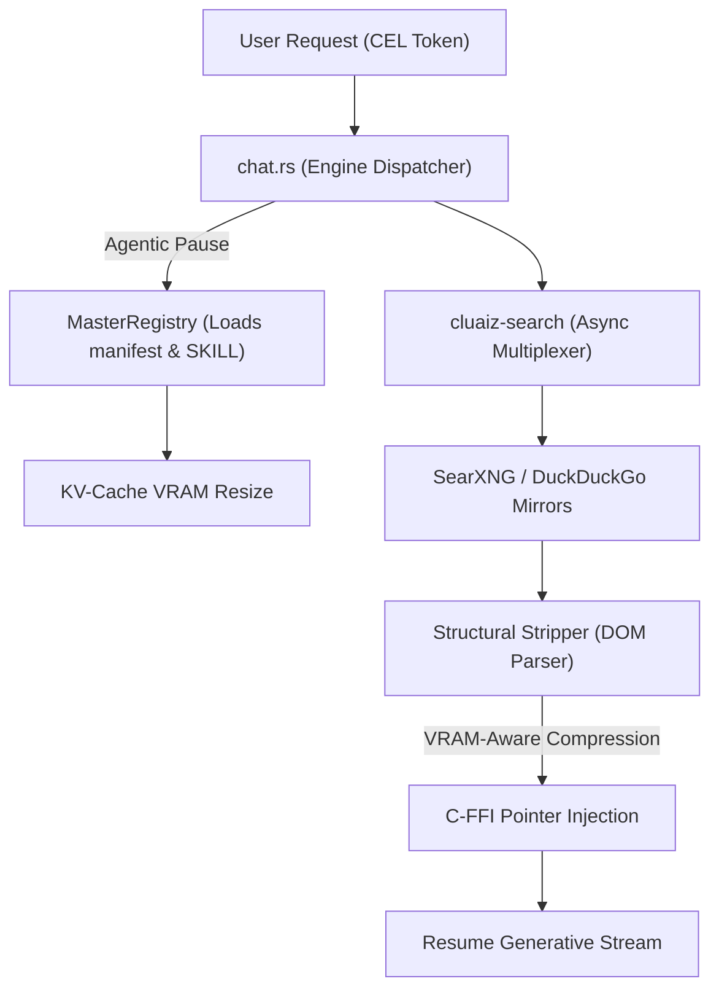

# Cluaiz Web Search (`cluaiz-search`)

## What is Cluaiz Web Search?
This is a Native Dynamic Library (`cdylib`) extension for the Cluaiz Engine. It provides hardware-aware web metasearch and DOM parsing via direct C-pointer KV-Cache injection. 

### How it works
The extension uses pure native async I/O (`reqwest` and `tokio`) to multiplex searches concurrently across public open-source mirrors like SearXNG and DuckDuckGo HTML endpoints. Instead of relying on heavy runtime environments or paid APIs, it extracts raw DOM paragraphs and OpenGraph metadata (like YouTube titles and descriptions) using the `scraper` crate. It strictly filters out JavaScript, CSS, and structural bloat to prevent VRAM overflow.

## CLI Commands (Extension Management)

The Cluaiz CLI provides full control over this extension via the Engine's local Extensibility API (acting as a wrapper for `/v1/skills/*` endpoints).

### 1. Install Extension
Downloads the `cluaiz-search` binary and `SKILL.md`, and loads it into the Cluaiz Engine.
```bash
cluaiz ext install cluaiz-search
```

### 2. Remove Extension
Safely unloads and permanently deletes the extension from your local system.
```bash
cluaiz ext remove cluaiz-search
```

### 3. List Installed Extensions
Scans active extensions running inside the engine's sandbox to confirm installation.
```bash
cluaiz ext list
```

### 4. Clear Extension Cache
Clears the pre-computed KV-caches and temporary DOM extractions associated with the search extension. Useful if search results get stuck or stale.
```bash
cluaiz ext cache clean cluaiz-search
```

### Post-Download Structure
After installation, the extension is placed in your local Cluaiz environment directory:

<details>
<summary><b>Click to view Installed Folder Tree</b></summary>

```text
.cluaiz/
└── extensions/
    └── cluaiz-search/
        ├── cluaiz-search_windows_x64.dll   # (or libcluaiz-search_macos_arm64.dylib / libcluaiz-search_linux_x64.so) Native binary
        ├── SKILL.md                        # AI Trigger Rules / CEL Syntax Rules injected at runtime
        ├── manifest-extension.yaml         # Core Engine Rules (Network and RAM limits)
        ├── references/                     # Helper documentation & guidelines for this extension
        │   └── search_heuristics.md
        ├── scripts/                        # Utility scripts for local extension tasks
        │   ├── deep_search_macro.cel
        │   └── fast_query_macro.cel
        └── .cache/                         # Temporary extraction cache
            ├── <model_name>.kvcache.bin    # Pre-compiled KV-Cache blocks for zero-copy memory injection
            └── <model_name>.emb.bin        # Vectorized embeddings of the search context
```

### Deep File Breakdown
- `cluaiz-search_windows_x64.dll` (or macOS/Linux equivalent):
  - **Logic:** The pre-compiled native extension binary.
  - **Flow:** Loaded dynamically at runtime by the Cluaiz Engine via C-FFI to execute zero-copy searches without any VM overhead.
- `SKILL.md`:
  - **Logic:** The AI Trigger Rules and behavioral guidelines.
  - **Flow:** Intercepted by the MasterRegistry during an Agentic Pause and injected directly into the active LLM context to teach it how to formulate search queries.
- `manifest-extension.yaml`:
  - **Logic:** Secure resource boundary definition.
  - **Flow:** Read by the Engine's hardware governor to enforce strict VRAM allocation limits and authorize outgoing network connections for this specific extension.
- `references/search_heuristics.md`:
  - **Logic:** Internal engine helper documentation.
  - **Flow:** Details ranking algorithms and DOM parsing rules used by the extension.
- `scripts/deep_search_macro.cel` & `scripts/fast_query_macro.cel`:
  - **Logic:** Predefined Cluaiz Expression Language (CEL) macros.
  - **Flow:** Loaded dynamically to trigger specific search behaviors (deep analytical vs fast superficial) without hardcoding logic.
- `.cache/<model_name>.emb.bin`:
  - **Logic:** Persistent embedding vectors of fetched search results.
  - **Flow:** Search results are instantly vectorized and cached here so they don't have to be re-embedded if the same context is needed again.
- `.cache/<model_name>.kvcache.bin`:
  - **Logic:** Direct VRAM memory snapshots.
  - **Flow:** The vectorized context is mapped directly into the Key-Value Cache matrix of the active model via JIT Injection. This file holds that state to allow instant context resumption.
</details>

## Developer Architecture & File Structure

<details>
<summary><b>Click to view Developer Source Code Tree</b></summary>

```text
cluaiz-search/
├── Cargo.toml                 # Rust dependencies and cdylib target configuration
├── README.md                  # This documentation file
├── SKILL.md                   # AI Trigger Rules / CEL Syntax Rules
├── manifest.yaml              # Core Engine Rules (Network allowed, RAM limits)
├── references/                # Helper documentation & guidelines for this extension
│   └── search_heuristics.md
├── scripts/                   # Utility scripts for building and testing
│   ├── deep_search_macro.cel
│   └── fast_query_macro.cel
└── src/
    ├── lib.rs                 # C-FFI Entry point (execute_cel) for the engine
    ├── search_engine/
    │   ├── mod.rs             # Module definitions
    │   ├── multiplexer.rs     # Async parallel request handling via tokio
    │   └── rotator.rs         # Fallback rotation logic if a mirror fails
    ├── parser/
    │   ├── mod.rs             # Module definitions
    │   ├── stripper.rs        # HTML/JS/CSS removal using scraper crate
    │   ├── metadata.rs        # Title, Meta Description, Logo extraction logic
    │   └── ranker.rs          # Hardware-Aware context compression and BM25 filter
    └── cel_bridge/
        └── command_parser.rs  # CEL to Rust logic mapper for developer manipulation
```

### Deep File Breakdown
- `src/lib.rs`: 
  - **Logic:** Implements the `execute_cel` FFI boundary.
  - **Flow:** Receives C-pointers from the main Cluaiz engine, spawns the Tokio blocking thread for search, and returns memory-safe pointers.
- `src/search_engine/mod.rs` & `src/parser/mod.rs`:
  - **Logic:** Module declarations and public interface exports.
  - **Flow:** Structures the codebase for clean FFI consumption.
- `src/search_engine/multiplexer.rs`:
  - **Logic:** Concurrent routing to public metasearch instances.
  - **Flow:** Spawns multiple concurrent `tokio` tasks and races them for the lowest latency response.
- `src/search_engine/rotator.rs`:
  - **Logic:** Fallback rotation logic.
  - **Flow:** Automatically shifts to backup open-source mirrors (e.g., SearXNG to DuckDuckGo) if primary instances fail or rate-limit, preventing single-node timeouts.
- `src/parser/stripper.rs`:
  - **Logic:** HTML/JS/CSS removal.
  - **Flow:** Uses the `scraper` crate to parse the DOM, extracting raw knowledge (paragraphs) while aggressively discarding structural bloat.
- `src/parser/metadata.rs`:
  - **Logic:** OpenGraph metadata extraction.
  - **Flow:** Extracts Title, Description, and Image tags from HTML heads (crucial for YouTube links) without fetching heavy transcripts.
- `src/parser/ranker.rs`:
  - **Logic:** Hardware-Aware context compression and BM25 filtering.
  - **Flow:** Dynamically checks VRAM limits and truncates/compresses the stripped text before returning the C-pointer, preventing OOM crashes.
- `src/cel_bridge/command_parser.rs`:
  - **Logic:** CEL to Rust logic mapper.
  - **Flow:** Allows developers to manipulate search parameters (max searches, context length) by parsing raw CEL tokens into native Rust structs.
- `scripts/deep_search_macro.cel` & `scripts/fast_query_macro.cel`:
  - **Logic:** Predefined Cluaiz Expression Language (CEL) macros.
  - **Flow:** Loaded dynamically to trigger specific search behaviors (deep analytical vs fast superficial) without hardcoding logic.
- `references/search_heuristics.md`:
  - **Logic:** Internal engine helper documentation.
  - **Flow:** Details ranking algorithms and DOM parsing rules used by the extension.
</details>

### Architectural Flow (Diagram)


## Research & Core Concepts

### Search Architecture (Native vs Standard Paradigms)
[FACT] Cloud-based AI platforms utilize massive data centers for web crawling. Standard open-source setups often rely on external scripting runtimes which consume excessive RAM and cause significant prefill delays.
[FACT] Local hardware (4GB-8GB VRAM) struggles with standard scripting search environments due to memory overhead.

| Aspect | Standard AI Platforms | Cluaiz Native Extension |
|--------|-----------------------|--------------------------|
| **Stack** | Heavy external runtimes | Pure Rust (`reqwest` + `scraper`) |
| **Search Engine** | Paid APIs ($$$) | Open-source Metasearch Mirrors (Free/Legal) |
| **VRAM Management** | Blind injection (Causes OOM) | **VRAM-Aware Arbiter** (Checks context envelope first) |

### Legal & Open-Source Compliance
- **[FACT]** No proprietary APIs are scraped. We read publicly available, legal, open-source Metasearch engines (SearXNG) and public HTML (DuckDuckGo). No copyright infringement occurs.
- **[FACT]** For YouTube links, the engine parses OpenGraph `<meta>` tags (Title, Description, Tags, Thumbnail) instead of fetching transcripts/subtitles to avoid bloat and legality issues.

### Utilizing the Mid-Layer C-FFI Stream
- **[FACT]** The Engine uses `dispatch_stream` in `chat.rs` to intercept tokens. It uses the MasterRegistry to pull the exact schema required without pre-loading all tools, ensuring resource efficiency for unused tools.
